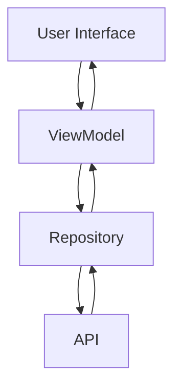

# RIPAD

RIPAD is an Android-based application designed to help farmers identify rice plant diseases and provide recommendations for suitable treatments. The app leverages AI technology to analyze images of affected plants and suggests appropriate remedies. Built with the **MVVM** architecture, it ensures modularity, scalability, and maintainability.

## Features

- **Disease Detection**: Upload or capture images of rice plants to detect potential diseases.
- **Treatment Recommendations**: Provides suggestions for effective treatments based on the detected disease.
- **AI Prediction**: Utilizes an API to analyze images and return AI-based predictions.
- **Responsive UI**: Ensures an intuitive and user-friendly interface for all users.

## Technologies Used

- **Language**: Kotlin
- **Architecture**: Model-View-ViewModel (MVVM)
- **Network**: Retrofit 2
- **Kotlin Coroutines**: For asynchronous operations
- **Dependency Injection**: Manual implementation
- **Firebase Authentication**: For secure user authentication
- **UI Components**: Jetpack LiveData, ViewModel, Fragment

## Application Architecture

The app architecture follows the MVVM pattern:

1. **View**: Fragments handle user interactions and display data from the ViewModel.
2. **ViewModel**: Connects the View to the Repository and manages data using LiveData/StateFlow.
3. **Repository**: Responsible for accessing data from the API using Retrofit.
4. **Remote API**: Uses REST-based endpoints to process image predictions and return treatment recommendations.

### Flow Diagram

