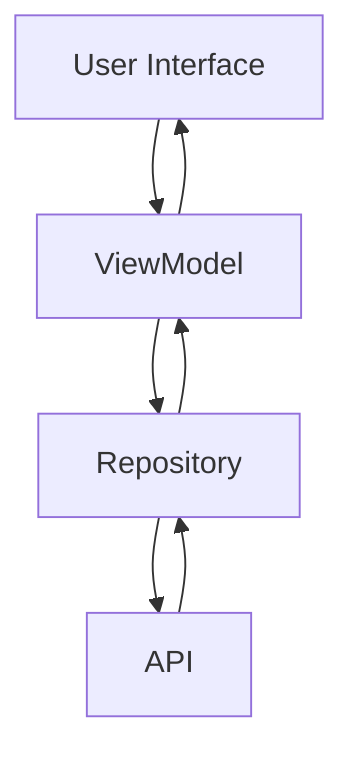

# RIPAD

Android-based application that allows users to upload images and receive AI-based predictions via an API. The app is designed using the **MVVM** architecture to ensure modularity, scalability, and code manageability.

## Features

- **Upload Images**: Users can select or capture images from their devices.
- **AI Prediction**: Uploaded images are sent to an API to obtain AI-based prediction results.
- **Responsive UI**: A simple and responsive user interface for optimal user experience.

## Technologies Used

- **Language**: Kotlin
- **Architecture**: Model-View-ViewModel (MVVM)
- **Network**: Retrofit 2
- **Kotlin Coroutines**: For asynchronous operations
- **Dependency Injection**: Manual implementation
- **Firebase Authentication**: For token authentication
- **UI Components**: Jetpack LiveData, ViewModel, Fragment

## Application Architecture

The app architecture follows the MVVM pattern:

1. **View**: Fragments handle user interactions and display data from the ViewModel.
2. **ViewModel**: Connects the View to the Repository and manages data using LiveData/StateFlow.
3. **Repository**: Responsible for accessing data from the API using Retrofit.
4. **Remote API**: Uses REST-based endpoints to process image predictions.

### Flow Diagram

